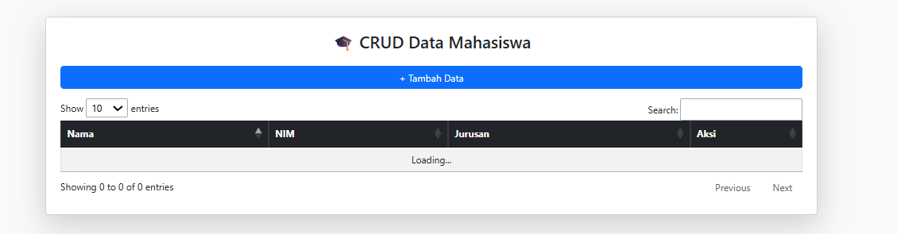
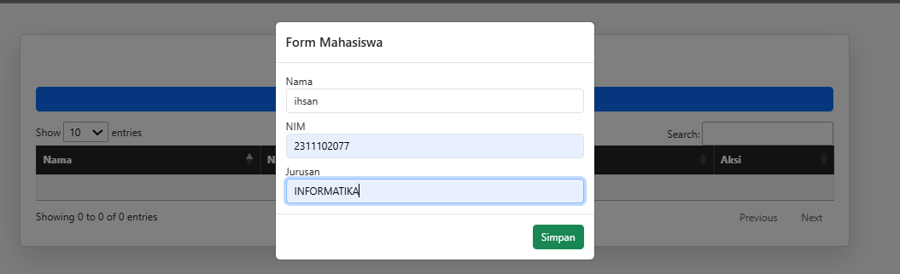
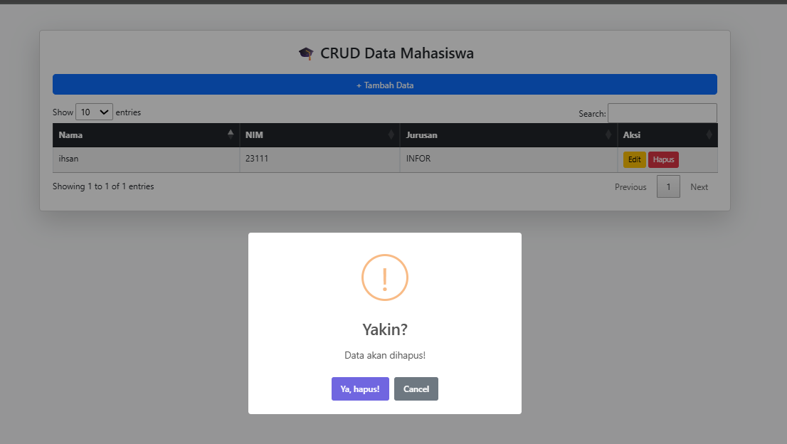

# Aplikasi CRUD Mahasiswa

---

## 👤 Identitas

* **Nama**: Muhamad Ihsan
* **NIM**: 2311102077
* **Jurusan**: Informatika

---

## Deskripsi

Aplikasi ini merupakan aplikasi CRUD berbasis web yang digunakan untuk mengelola data mahasiswa.
User dapat menambahkan, mengedit, menghapus, dan melihat data.

---

## ⚙️ Teknologi

* HTML
* CSS
* JavaScript
* PHP / Laravel
* MySQL

---

## ✨ Fitur

* Tambah data mahasiswa
* Edit data mahasiswa
* Hapus data mahasiswa
* Tampilkan data mahasiswa

---

## 📸 Screenshot

## link drive PPT Presentasi dan Video Presentasi

https://link-video-kamu

## Kesimpulan

Project ini membantu memahami konsep CRUD dan pengembangan aplikasi web sederhana.
